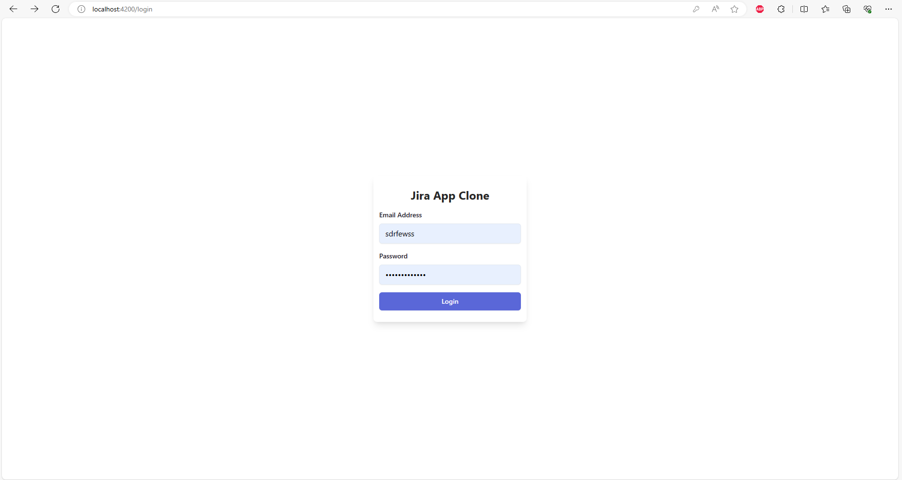
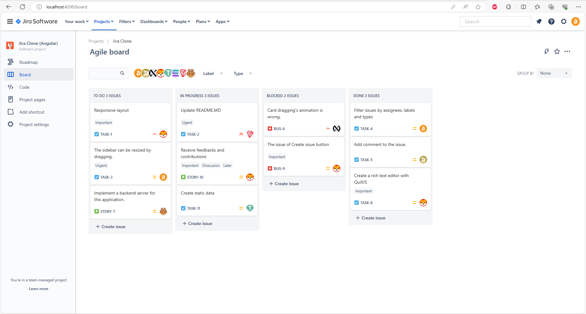

## Description

It is a Jira app clone on angular version 17.2.1. This project uses UI component (Ant design, Taiwindcss) and state management (NGRX)
1. Login Screen
    
2. Project Dashboard 
    

## Installation

```bash
$ npm install
```

## Development server

Run `ng serve` for a dev server. Navigate to `http://localhost:4200/`. The application will automatically reload if you change any of the source files.

## Build

Run `ng build` to build the project. The build artifacts will be stored in the `dist/` directory.

## Stay in touch

- Email - nguyentrung96dn@gmail.com
- Linkedin - [linkedin.com](nkedin.com/in/trungnguyen-be)